  

## - Projects

| Project | What it does | Stack |
|---|---|---|
| **Manga OCR Pipeline** (FYP) | Multi-engine OCR system for manga, handwritten & stylised text. SVM classifier + ensemble method for script disambiguation. | Python · Tesseract · SVM |
| **Social Bias Detection** | Multi-output neural network detecting gender, racial & political bias simultaneously - F1 of 0.85. | PyTorch · NLP |
| **KomodoHub** | Multi-user educational platform built across Agile sprints. Full-stack, deployed and user-tested. | Flask · SQLite · JS |
| **Secure E-Commerce Backend** | OWASP threat modelling, Flask security stack, Bandit + Safety audits. Built to be broken, then hardened. | Flask · OWASP · Bandit |

---

## - Tech stack

**ML / AI**

**Web / Backend**

**Game dev (learning)**

**Other**

---

## - GitHub stats

  
  

  

---

## - Contribution snake

  <picture>
    <source media="(prefers-color-scheme: dark)" srcset="https://raw.githubusercontent.com/Shayanmh2/Shayanmh2/output/github-contribution-grid-snake-dark.svg" />
    <source media="(prefers-color-scheme: light)" srcset="https://raw.githubusercontent.com/Shayanmh2/Shayanmh2/output/github-contribution-grid-snake.svg" />
    
  </picture>

---

## - Currently

-  FYP done - awaiting graduation in July 2026
-  Diving into game development with Godot and Unity
-  Exploring computer vision and transformer architectures
-  Open to grad roles in ML/AI, software engineering, and game dev

> Catching upto bookmarks &nbsp;·&nbsp;  Making and learning game dev stuff, them &nbsp;·&nbsp;  hype music looping indefinitely

---

   Open to grad roles - reach out via <a href="https://linkedin.com/in/shayanmh2">LinkedIn</a> 
  <em>Built with my life on the line :D.</em>

